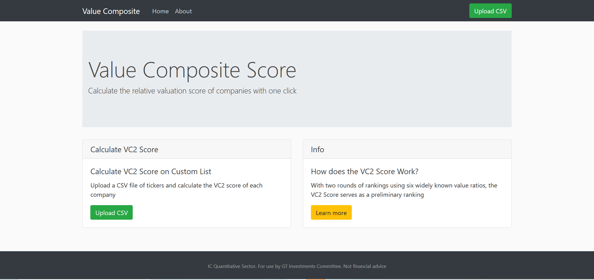
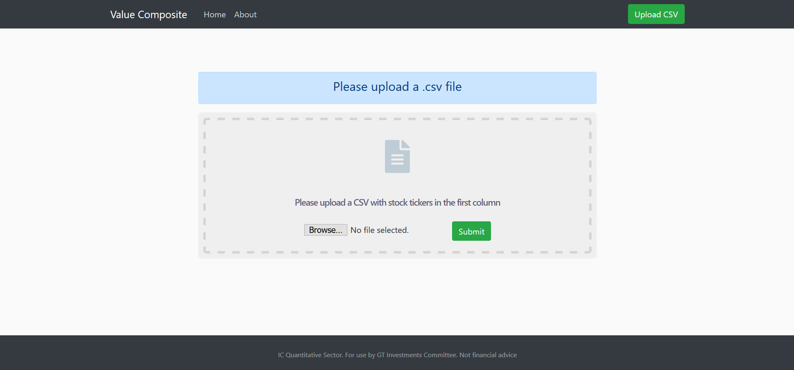
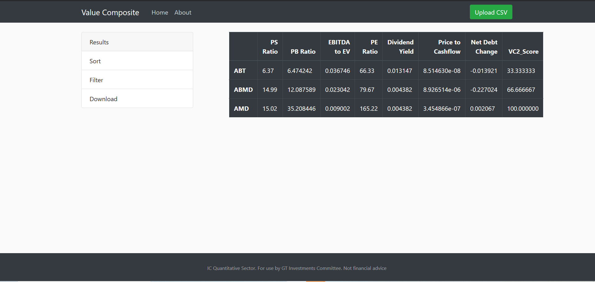

# vc2_webapp

### GOAL
* Calculate the Value Composite 2 Score on a list of uploaded stocks
* Provides a score 1 - 100 for each stock uploaded, 1 is most undervalued 100 is most overvalued (relative)
* Meant to aid research process of other sectors in the GT Student Investments Committee



### Process
* List of stocks is uploaded as ```.csv``` file
* Data is pulled from ```IEX Cloud API```
* Value Ratios are Calculated:
    1. Price-to-Book
    2. Price-to-Earnings
    3. Price-to-Sales
    4. EBITDA/EV
    5. Price-to-Cash flow
    6. Shareholder Yield
* Two Rounds of rankings are performed, first for individual ratios then for aggregate
* Stocks are assigned a score based on final round of ranking, 1 is most undervalued, 100 is most overvalued

### Screenshots
##### Data Upload Page:


##### Results Page (Downloadable csv):


### TODO
* Fix .xlsx files being overwritten (good) but not downloaded when they are overwritten (bad). Clearing cache fixes this
* Clean up code, especially routes in ```valuecomposite.py```
* Add info on about page